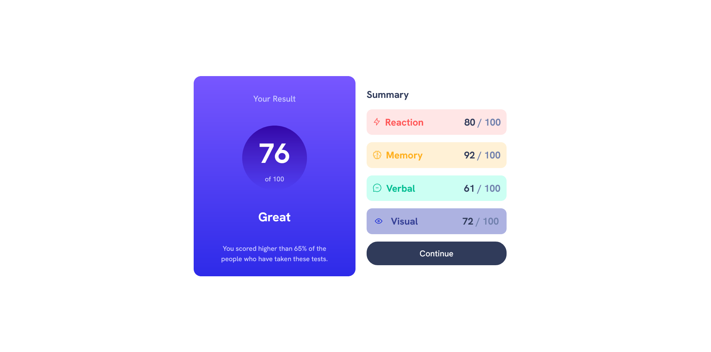

# Frontend Mentor - Results summary component solution

This is a solution to the [Results summary component challenge on Frontend Mentor](https://www.frontendmentor.io/challenges/results-summary-component-CE_K6s0maV). Frontend Mentor challenges help you improve your coding skills by building realistic projects. 

## Table of contents

- [Overview](#overview)
  - [The challenge](#the-challenge)
  - [Screenshot](#screenshot)
  - [Links](#links)
- [My process](#my-process)
  - [Built with](#built-with)
  - [What I learned](#what-i-learned)
  - [Continued development](#continued-development)
  - [Useful resources](#useful-resources)
- [Author](#author)
- [Acknowledgments](#acknowledgments)

**Note: Delete this note and update the table of contents based on what sections you keep.**

## Overview

### The challenge

Users should be able to:

- View the optimal layout for the interface depending on their device's screen size
- See hover and focus states for all interactive elements on the page

### Screenshot




### Links

- Solution URL: [Add solution URL here](https://your-solution-url.com)
- Live Site URL: [Add live site URL here](https://your-live-site-url.com)

## My process

### Built with

- Semantic HTML5 markup
- CSS custom properties
- Flexbox
- CSS Grid
- Mobile-first workflow

### What I learned
I learned how to make a Vertically center text within a rounded div. Also learned how to make gradient background.


```html
<div class="total__mark">
            <p class="marks-obtained">76</p>
            <p class="out-of">of 100</p>
          </div>
```
```css
.total__mark{
  background: linear-gradient(var(--clr-violet-blue),var(--clr-persian-blue));
 
  /* To make div circle and placing all the content in center*/
  width: 140px;
  height: 140px;
  border-radius: 140px;
  text-align: center;
  overflow: hidden;
  display: table-cell;
  vertical-align:middle;
}
```


### Useful resources

- [Stackoverflow Article](https://stackoverflow.com/questions/21306741/vertically-center-text-within-a-rounded-div) - This helped me for XYZ reason. I really liked this pattern and will use it going forward.


## Author

- Website - [Shashikant](https://www.your-site.com)
- Frontend Mentor - [@shashikantdev3](https://www.frontendmentor.io/profile/shashikantdev3)
- Twitter - [@shashikantdev3](https://www.twitter.com/shashikantdev3)
